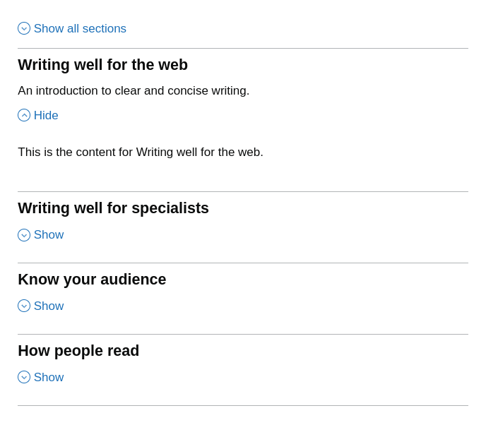
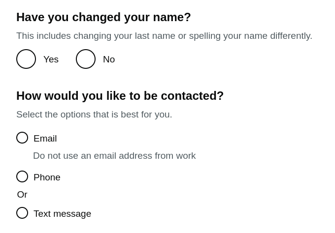
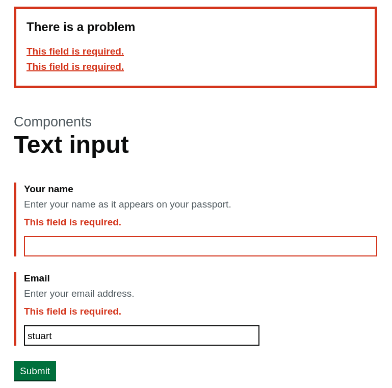

================
Crispy Forms GDS
================

A `GOV.UK Design System`_ template pack for `django-crispy-forms`_, for simple and
powerful form generation which is compliant with GDS usability and accessibility
guidelines.

.. _django-crispy-forms: https://github.com/maraujop/django-crispy-forms/
.. _GOV.UK Design System: https://design-system.service.gov.uk/

.. image:: https://codecov.io/gh/wildfish/crispy-forms-gds/branch/master/graph/badge.svg
  :target: https://codecov.io/gh/wildfish/crispy-forms-gds

.. image:: https://badge.fury.io/py/crispy-forms-gds.svg
    :target: https://pypi.python.org/pypi/crispy-forms-gds/

.. image:: https://img.shields.io/pypi/pyversions/crispy-forms-gds.svg
    :target: https://pypi.python.org/pypi/crispy-forms-gds/

Compatibility
=============
+------------------+--------------------------+---------------------+------------------+
| crispy-forms-gds | Government Design System | django-crispy-forms | django           |
+------------------+--------------------------+---------------------+------------------+
| 0.x              | 3.5                      | 1.x - 2.2           | 3.2 LTS, 4.2 LTS |
+------------------+--------------------------+---------------------+------------------+
| 1.x              | 3.5                      | 2.0 - 2.2           | 4.2 LTS          |
+------------------+--------------------------+---------------------+------------------+

Quickstart
==========

This is a minimal howto without options or details - see the
`crispy-forms-gds documentation <http://crispy-forms-gds.readthedocs.io/>`_ for full
instructions for installation and usage.

Install using pip::

    pip install crispy-forms-gds

Add to installed apps, with settings to tell django-crispy-forms to use this theme::

    INSTALLED_APPS = [
      ...
      'crispy_forms',
      'crispy_forms_gds',
    ]
    CRISPY_ALLOWED_TEMPLATE_PACKS = ["gds"]
    CRISPY_TEMPLATE_PACK = "gds"

Build a regular crispy form using layout objects from ``crispy_forms_gds``::

    from django import forms

    from crispy_forms_gds.helper import FormHelper
    from crispy_forms_gds.layout import Submit

    class SimpleForm(forms.Form):

        name = forms.CharField(
            label="Name",
            help_text="Your full name.",
            widget=forms.TextInput(),
            error_messages={
                "required": "Enter your name as it appears on your passport"
            }
        )

        def __init__(self, *args, **kwargs):
            super().__init__(*args, **kwargs)
            self.helper = FormHelper()
            self.helper.add_input(Submit("submit", "Submit"))

Render the form in your templates as normal::

    
    

Examples
========

The template pack supports all the basic components listed in the `GOV.UK Design
System`_. Here are some examples taken from the demo site included in the project.

Accordion
---------

.. _Accordion: https://design-system.service.gov.uk/components/accordion/

Layout components, such as the `Accordion`_ let you generate complex forms with
multiple sections::

    from django import forms

    from crispy_forms_gds.helper import FormHelper
    from crispy_forms_gds.layout import HTML, Accordion, AccordionSection, Layout

    class AccordionForm(forms.Form):
        def __init__(self, *args, **kwargs):
            super().__init__(*args, **kwargs)
            self.helper = FormHelper()
            self.helper.layout = Layout(
                Accordion(
                    AccordionSection(
                        "Writing well for the web",
                        HTML.p("This is the content for Writing well for the web."),
                        summary="An introduction to clear and concise writing.",
                    ),
                    AccordionSection(
                        "Writing well for specialists",
                        HTML.p("This is the content for Writing well for specialists."),
                    ),
                    AccordionSection(
                        "Know your audience",
                        HTML.p("This is the content for Know your audience."),
                    ),
                    AccordionSection(
                        "How people read",
                        HTML.p("This is the content for How people read."),
                    ),
                )
            )

Radio Buttons
-------------

.. _Radio: https://design-system.service.gov.uk/components/radios/
.. _Select: https://design-system.service.gov.uk/components/select/

ChoiceFields can be displayed as `Select`_ or `Radio`_ components. Radio buttons also support
Design System features such as sizing, hinting and dividers::

    from django import forms

    from crispy_forms_gds.choices import Choice
    from crispy_forms_gds.helper import FormHelper
    from crispy_forms_gds.layout import Button, Field, Layout, Size

    class RadiosForm(forms.Form):

        name = forms.ChoiceField(
            choices=(("yes", "Yes"), ("no", "No")),
            widget=forms.RadioSelect,
            label="Have you changed your name?",
            help_text="This includes changing your last name or spelling your name differently.",
            error_messages={"required": "Enter whether your name has changed"},
        )

        METHODS = (
            Choice("email", "Email", hint="Do not use an email address from work"),
            Choice("phone", "Phone", divider="Or"),
            Choice("text", "Text message"),
        )

        method = forms.ChoiceField(
            choices=METHODS,
            widget=forms.RadioSelect,
            label="How would you like to be contacted?",
            help_text="Select the options that is best for you.",
            error_messages={
                "required": "Select the best way to send a confirmation message"
            },
        )

        def __init__(self, *args, **kwargs):
            super().__init__(*args, **kwargs)
            self.helper = FormHelper()
            self.helper.layout = Layout(
                Field.radios("name", legend_size=Size.MEDIUM, legend_tag="h1", inline=True),
                Field.radios("method", legend_size=Size.MEDIUM, small=True),
                Button("submit", "Submit"),
            )

Validation Errors
-----------------

.. _Error Summary: https://design-system.service.gov.uk/components/error-summary/
.. _Error Message: https://design-system.service.gov.uk/components/error-message/

Forms fully support the `Error Message`_ and `Error Summary`_ components with no
extra effort on your part::

    from django import forms

    from crispy_forms_gds.helper import FormHelper
    from crispy_forms_gds.layout import (
        Button,
        Field,
        Fieldset,
        Fixed,
        Fluid,
        Layout,
        Size,
    )

    class UserForm(forms.Form):

        name = forms.CharField(
            label="Your name",
            help_text="Enter your name as it appears on your passport.",
        )

        email = forms.CharField(
            label="Email",
            help_text="Enter your email address.",
            widget=forms.EmailInput,
        )

        phone = forms.CharField(
            label="Phone",
            help_text="Enter your home or mobile telephone number.",
        )

        def __init__(self, *args, **kwargs):
            super().__init__(*args, **kwargs)
            self.helper = FormHelper()
            self.helper.label_size = Size.SMALL
            self.helper.layout = Layout(
                Fieldset(
                    Field.text("name"),
                    Field.text("email", field_width=Fluid.TWO_THIRDS),
                    Field.text("phone", field_width=Fixed.TEN),
                ),
                Button("submit", "Submit"),
            )

Demo
====

If you checkout the code from the repository, there is a Django site you can run to see
the forms in action::

    git clone git@github.com:wildfish/crispy-forms-gds.git
    cd crispy-forms-gds

First, create a virtual environment::

    python3 -m venv venv
    . venv/bin/activate
    pip3 install wheel
    pip3 install -r requirements/dev.txt

Next, install all the dependencies and build the javascript and css assets::

    cd demo/frontend
    nvm use
    npm install
    npm run dev

Now, setup and run Django::

    cd ..
    python3 manage.py migrate
    python3 manage.py runserver

Open http://localhost:8000/ in your browser to see forms built with `Django Crispy Forms`_
styled using the `GOV.UK Design System`_.

Resources
=========

* Read the documentation on `Read the docs`_
* Download the `PyPi package`_
* Learn more about `Django Crispy Forms`_

.. _Read the docs: http://crispy-forms-gds.readthedocs.io/
.. _PyPi package: http://pypi.python.org/pypi/crispy-forms-gds
.. _Django Crispy Forms: https://django-crispy-forms.readthedocs.io/en/latest/
