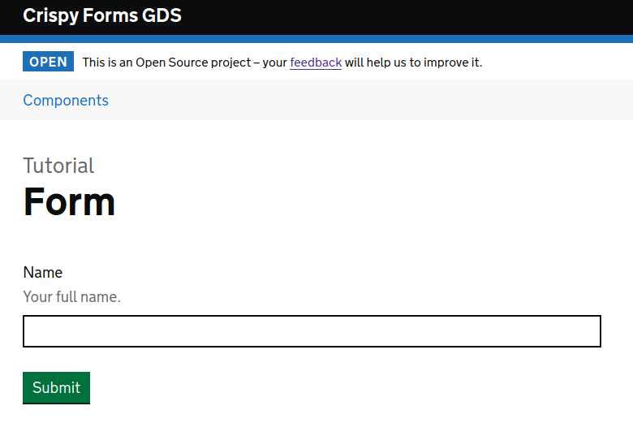

================
Crispy Forms GDS
================

A `GOV.UK Design System`_ template pack for `django-crispy-forms`_, for simple and
powerful form generation which is compliant with GDS usability and accessibility
guidelines.

.. _django-crispy-forms: https://github.com/maraujop/django-crispy-forms/
.. _GOV.UK Design System: https://design-system.service.gov.uk/

.. image:: https://travis-ci.org/wildfish/crispy-forms-gds.svg?branch=master
    :target: https://travis-ci.org/wildfish/crispy-forms-gds

.. image:: https://codecov.io/gh/wildfish/crispy-forms-gds/branch/master/graph/badge.svg
  :target: https://codecov.io/gh/wildfish/crispy-forms-gds

.. image:: https://badge.fury.io/py/crispy-forms-gds.svg
    :target: https://pypi.python.org/pypi/crispy-forms-gds/

.. image:: https://img.shields.io/pypi/pyversions/crispy-forms-gds.svg
    :target: https://pypi.python.org/pypi/crispy-forms-gds/

Requires Django 2.2 or later and django-crispy-forms 1.9 or later.

This template pack supports govuk-frontend 3.5 or later.

Quickstart
==========

This is a minimal howto without options or details - see the
`crispy-forms-gds documentation <http://crispy-forms-gds.readthedocs.io/>`_ for full
instructions for installation and usage.

Install using pip::

    pip install crispy-forms-gds

Add to installed apps, with settings to tell django-crispy-forms to use this theme::

    INSTALLED_APPS = [
      ...
      'crispy_forms',
      'crispy_forms_gds',
    ]
    CRISPY_ALLOWED_TEMPLATE_PACKS = ["gds"]
    CRISPY_TEMPLATE_PACK = "gds"

Build a regular crispy form using layout objects from ``crispy_forms_gds``::

    from django import forms

    from crispy_forms_gds.helper import FormHelper
    from crispy_forms_gds.layout import Submit

    class TextInputForm(forms.Form):

        name = forms.CharField(
            label="Name",
            help_text="Your full name.",
            widget=forms.TextInput(),
            error_messages={
                "required": "Enter your name as it appears on your passport"
            }
        )

        def __init__(self, *args, **kwargs):
            super().__init__(*args, **kwargs)
            self.helper = FormHelper()
            self.helper.add_input(Submit("submit", "Submit"))

Render the form in your templates as normal::

    
    

Open the page in your browser:

Features
========

The template pack supports all the basic components listed in the `GOV.UK Design
System`_:

.. image:: https://i.imgur.com/RCTUPrg.png

Demo
====

If you checkout the code from the repository, there is a Django site you can run to see
the forms in action. You will need to `install nvm`_ first (to manage node versions),
then build and run the demo with::

    make serve

.. _install nvm: https://github.com/nvm-sh/nvm

Further reading
===============

* Read the documentation on `Read the docs`_
* Download the `PyPi package`_
* Learn more about `Django Crispy Forms`_

.. _Read the docs: http://crispy-forms-gds.readthedocs.io/
.. _PyPi package: http://pypi.python.org/pypi/crispy-forms-gds
.. _Django Crispy Forms: https://django-crispy-forms.readthedocs.io/en/latest/
