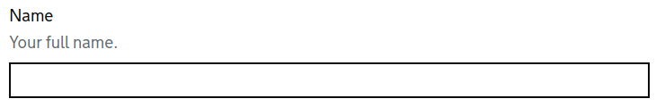
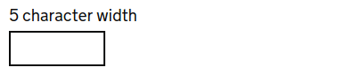
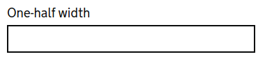

.. _Text input: https://design-system.service.gov.uk/components/text-input/
.. _TextInput: https://docs.djangoproject.com/en/3.0/ref/forms/widgets/#django.forms.TextInput
.. _CharField: https://docs.djangoproject.com/en/3.0/ref/forms/fields/#charfield
.. _DurationField: https://docs.djangoproject.com/en/3.0/ref/forms/fields/#durationfield
.. _GenericIPAddressField: https://docs.djangoproject.com/en/3.0/ref/forms/fields/#genericipaddressfield
.. _RegexField: https://docs.djangoproject.com/en/3.0/ref/forms/fields/#regexfield
.. _SlugField: https://docs.djangoproject.com/en/3.0/ref/forms/fields/#slugfield
.. _UUIDField: https://docs.djangoproject.com/en/3.0/ref/forms/fields/#uuidfield
.. _ComboField: https://docs.djangoproject.com/en/3.0/ref/forms/fields/#combofield
.. _MultiValueField: https://docs.djangoproject.com/en/3.0/ref/forms/fields/#multivalidfield
.. _input purpose: https://www.w3.org/TR/WCAG21/#input-purposes

##########
Text input
##########
Turning a CharField into a Design System `Text input`_ component is simplicity itself: ::

    class TextForm(forms.Form):

        use_required_attribute = False

        name = forms.CharField(
            label=_("Name"),
            help_text=_("Your full name."),
            error_messages={
                "required": _("Enter your name as it appears on your passport")
            }
        )

All the basic attributes and classes are added by the ``crispy-forms-gds`` template
pack so the rendered form follow the Design System style guide and meets all the
requirements for accessibility.

Any Django form field which uses a `TextInput`_ widget is also rendered as a `Text input`
component. That also includes: `DurationField`_, `GenericIPAddressField`_, `RegexField`_,
`SlugField`_, `UUIDField`_, `ComboField`_ and `MultiValueField`_.

Changing the width of a field
=============================
Text inputs, by default, take up the full width of the parent container. You can
create text fields of different sizes by setting the ``width`` attribute on the
field's TextInput widget.

Fixed width fields can be either: 2, 3, 4, 5, 10, 20 or 30 characters wide: ::

    name = forms.CharField(
        ...
        widget = TextInput(attrs={"width": 5}),
        ...
    )

Relative width fields are created by setting the width to one of the following
strings: 'one-quarter', 'one-third', 'one-half', 'two-thirds', 'three-quarters'
or 'full': ::

    name = forms.CharField(
        ...
        widget = TextInput(attrs={"width": "one-half"}),
        ...
    )

For fixed or relative widths, if the value given not supported then a full width
field is shown.

The ``width`` attribute is just a short-cut. When the field is rendered in a
template the attribute is translated into the respective Design System CSS
class, e.g. ``govuk-input--width-5`` or ``govuk-!-width-one-half`` and added
to the <input> element.

Displaying fields with numbers
==============================
.. _does not recommend: https://design-system.service.gov.uk/components/text-input/#numbers

The GOV.UK Design System `does not recommend`_ using ``<input type="number">`` for
displaying numeric values as there is a high risk of error. Instead, when using an
IntegerField in a form change the default ``NumberInput`` widget to be a ``TextInput``.
Then you can set the width and add the necessary classes to bring up the numeric
keypad on mobile devices: ::

    age = forms.IntegerField(
        label=_("Age"),
        help_text=_("How old are you?"),
        widget = TextInput(attrs={
            "width": 4,
            "pattern": "[0-9]*",
            "inputmode": "numeric",
        }),
        error_messages={
            "required": _("Enter your age at your last birthday")
        }
        ...
        ...
    )

The ``pattern`` and ``inputmode`` (and any other attribute) is added to the
``<input>`` field when it is displayed.

Filling out forms easily
========================
To make forms easier to fill out you can let the browser do some of the work by
setting the ``autocomplete`` attribute with the appropriate `input purpose`_ on
the TextInput widget: ::

    post_code = forms.CharField(
        ...
        widget = TextInput(attrs={"autocomplete": "postal-code"}),
        ...
    )

The browser can then autofill the field if the user has entered the information
previously.

Turning spellchecking on and off
================================
We have seen already that attributes set on the widget used to render a field
are passed directly and included as attributes on the ``<input>`` element.

To enable or disable spellchecking by the browser on a field, for example an
email address or numeric field the ``spellcheck`` attribute has to be set to
``true`` or ``false``. It's an enumerated attribute not a boolean one but booleans
in code are less work so the ```` templatetag will
check to see if the ``spellcheck`` attribute is set to a boolean and convert it
to a string as needed: ::

    name = forms.CharField(
        ...
        widget = TextInput(attrs={"spellcheck": False}),
        ...
    )

If you like typing, you can always go ahead and use the string: ::

    name = forms.CharField(
        ...
        widget = TextInput(attrs={"spellcheck": "false"}),
        ...
    )

