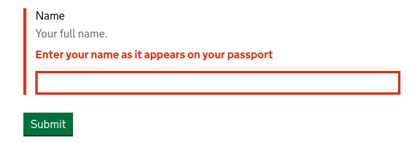

.. _appropriately sized text widths: https://design-system.service.gov.uk/components/text-input/#use-appropriately-sized-text-inputs

=======
Example
=======
You use crispy-forms-gds just like a regular crispy form except you import
the various objects from ``crispy_forms_gds`` instead of crispy_forms: ::

    from django import forms
    from django.utils.translation import ugettext_lazy as _

    from crispy_forms_gds.helper import FormHelper
    from crispy_forms_gds.layout import Submit

    class TextInputForm(forms.Form):

        name = forms.CharField(
            label=_("Name"),
            help_text=_("Your full name."),
            error_messages={
                "required": _("Enter your name as it appears on your passport")
            }
        )

        def __init__(self, *args, **kwargs):
            super().__init__(*args, **kwargs)
            self.helper = FormHelper()
            self.helper.add_input(Submit("submit", _("Submit")))

Then you render the form in true, crispy style: ::

    
    ...
    
    ...

That's all you need to generate the following:

.. image:: form.png

The templates built into the template pack ensure that everything matches the
layout recommended in the GDS guidelines (reformatted for readability): ::

    <form method="post">
        <input type="hidden" name="csrfmiddlewaretoken" value="...">
        

            <label for="id_name" class="govuk-label">
                Name
            </label>
            

                Your full name.
            

            <input type="text"
                   id="id_name"
                   name="name"
                   class="govuk-input"
                   aria-describedby="hint_id_name">
        

        <input type="submit"
               name="submit"
               value="Submit"
               class="govuk-button" id="submit-id-submit">
    </form>

Any validation errors are properly annotated with the respective error classes.

The ARIA attributes are also updated to make everything accessible: ::

    <form method="post">
        ...
        

            ...
            
                Error:
                Enter your name as it appears on your passport
            
            <input ...
                   class="... govuk-input--error"
                   aria-describedby="... id_name_1_error">
        

        ...
    </form>
