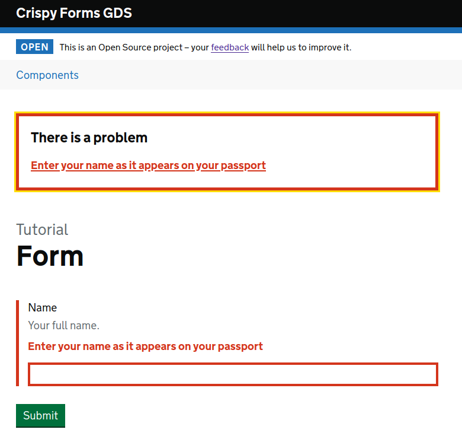

.. _GOV.UK Design System: https://design-system.service.gov.uk

========
Tutorial
========

This is a step by step guide to learn how to use ``crispy-forms-gds`` using Django 2.2
or later to create forms that follow the design and accessibility guidelines of the
`GOV.UK Design System`_.

``crispy-forms-gds`` is a template pack, i.e. plugin, for ``django-crispy-forms`` so
it helps if you are already familiar with creating forms the 'crispy-way' however
all the steps are simple and straight-forward, so it's not really necessary.

The install guide inconveniently glosses over how to add the Design System javascript
to your application - we're working on how to come up with clear and concise instructions
but the diversity and complexity of front-end development does not make that easy. So
the best place to start is to use the Demo site.

First let's create a Django app in the Demo site so we have somewhere to add our form.
We will use the project makefile to create the virtualenv, build the static assets
containing the Design System styles and javascript and add the tutorial app to the
Demo site:

.. code-block:: bash

    make venv
    make frontend
    source ./venv/bin/activate
    mkdir ./demo/backend/tutorial
    PYTHONPATH=src python demo/manage.py startapp tutorial ./demo/backend/tutorial

The 'startapp' command is a little more complicated than usual but it's only because
of the way we've laid out the template pack source code and the demo site.

First let's add our app to the settings::

    # demo/backend/settings.py
    INSTALLED_APPS = [
        ...
        "crispy_forms_gds",
        "backend.components",
        "backend.tutorial"
    ]

Let's create our form::

    # demo/backend/tutorial/forms.py
    from django import forms

    from crispy_forms_gds.helper import FormHelper
    from crispy_forms_gds.layout import Button, Layout

    class TutorialForm(forms.Form):
        name = forms.CharField(
            label="Name",
            help_text="Your full name.",
            error_messages={"required": "Enter your name as it appears on your passport"},
        )

        def __init__(self, *args, **kwargs):
            super().__init__(*args, **kwargs)
            self.helper = FormHelper()
            self.helper.layout = Layout("name", Button("submit", "Submit"))

It's not very impressive, as forms go, but it does have everything you need to
create forms for Design System sites. Everything from here on is just a refinement.

Now add a generic ``FormView`` to display the form::

    # demo/backend/tutorial/views.py
    from django.urls import reverse_lazy
    from django.views.generic import FormView

    from .forms import TutorialForm

    class TutorialView(FormView):
        template_name = "tutorial/index.html"
        form_class = TutorialForm
        success_url = reverse_lazy("home")

Add the template to display the form::

    # demo/backend/tutorial/templates/tutorial/index.html
    
    

    

      

      
        Tutorial
      
      <h1 class="govuk-heading-xl">
        Form
      </h1>

      

        
      

    

We took the liberty of using the base template for the demo site. This is a
production-ready template for the Design System and there's way too much going
on in it to include it all here.

Add the view to your urls.py::

    # demo/backend/urls.py
    from django.urls import include, path
    from django.views.generic.base import RedirectView

    from .tutorial.views import TutorialView

    urlpatterns = [
        path(r"", RedirectView.as_view(url="components/"), name="home"),
        path(r"components/", include("backend.components.urls", namespace="components")),
        path(r"tutorial", TutorialView.as_view(), name="tutorial"),
    ]

Finally, run the demo site::

    make serve

and point your browser qt ``http://localhost:8000/tutorial/``. You should be able to
see your form looks at lot like the following:

.. image:: form.png

Now, without entering anything into the name field, hit the ``Submit`` button.

.. _Error summary: https://design-system.service.gov.uk/components/error-summary/

Whoa! That's a full, Design System `Error summary`_ complete with links to the
offending fields.

That's it. You're now a fully qualified, Django Design System (DjDS) Developer.

Next steps
==========
The best route to take from here is to play with the demo site or better still,
start adding the component from each example to the tutorial form. That way
you will get a better feel of how it all works.
